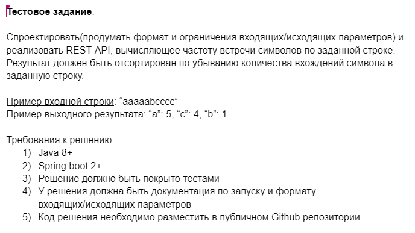
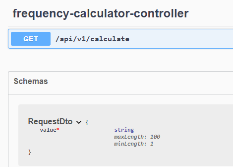

# Test task

###### FrequencyCalculator app



Requirements
=======

* Java 11
* Spring Boot 2
* Tests
* Gradle Build
* Docker container

Usage/Docs API
=======

# endpoints api docs:

```
# see port value in file: .env-dev-example, default is 8080
http://localhost:$PORT/swagger-ui/index.html
# default
http://localhost:8080/swagger-ui/index.html
```



Build
=======
To build and run this application locally, you'll need Git and JDK installed on your computer.

Docker instructions:

```
# Clone this repository
$ git clone https://github.com/alexandr-khvatov/frequency-calculator.git

# Go into the repository
$ cd frequency-calculator

# Build and run container
$ docker-compose --env-file .env-dev-example up

```

From your command line:

```
# Clone this repository
$ git clone https://github.com/alexandr-khvatov/frequency-calculator.git

# Go into the repository
$ cd frequency-calculator

# Build
$ ./gradlew build

# Run the app
$ java -jar build/libs/*-SNAPSHOT.jar
```